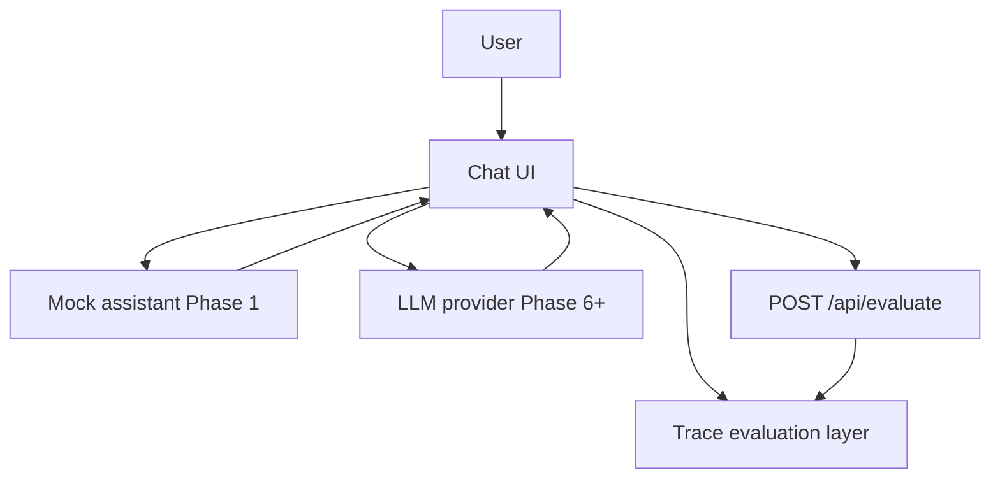
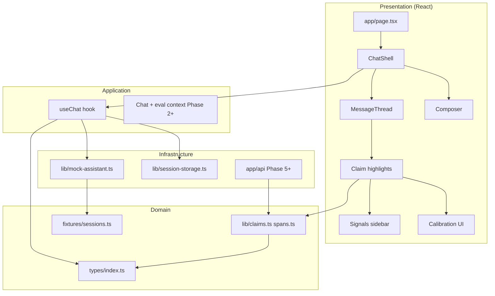
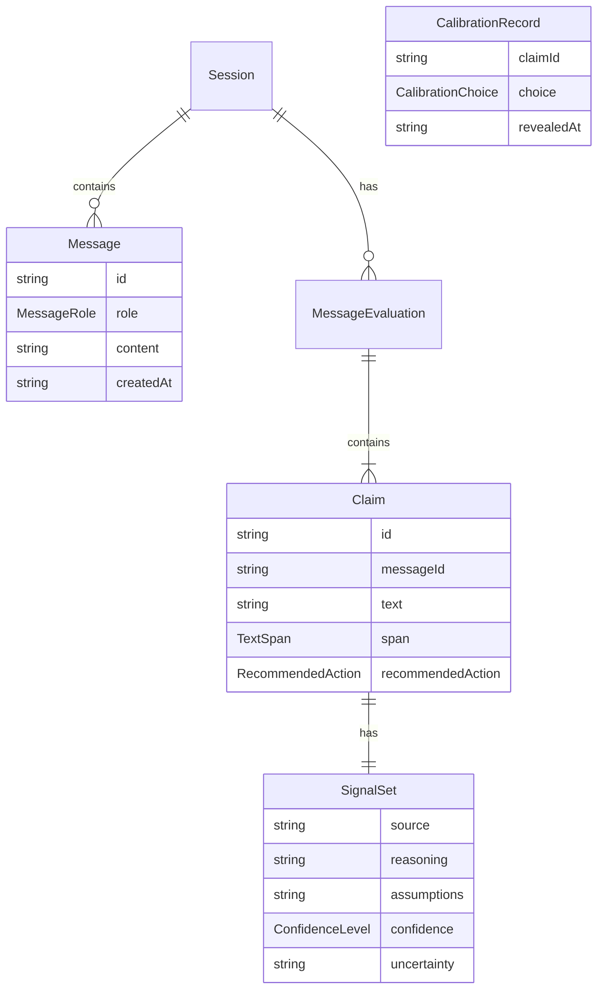
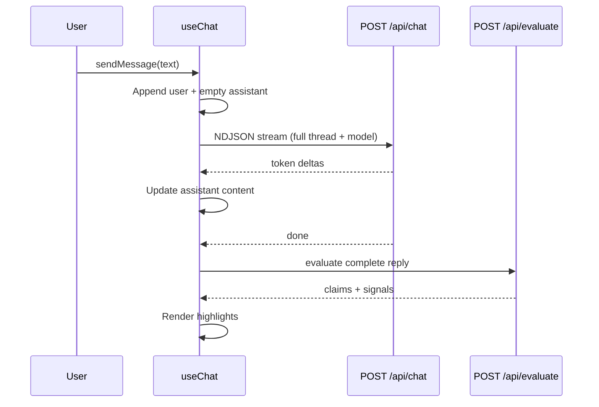
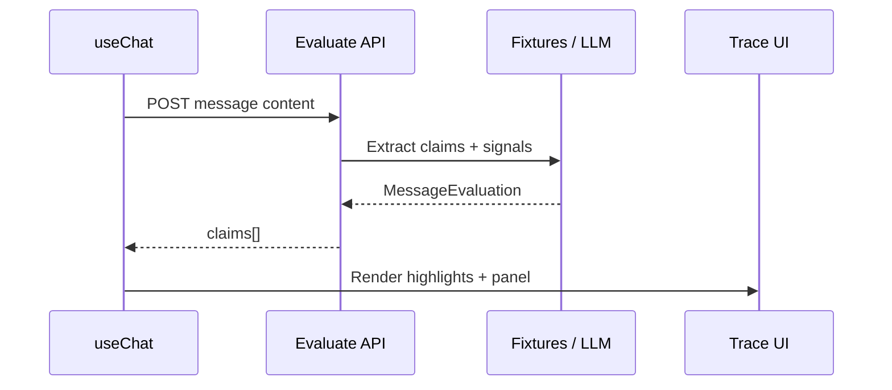
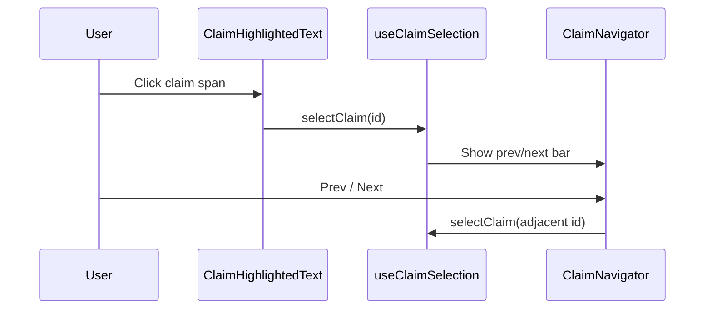
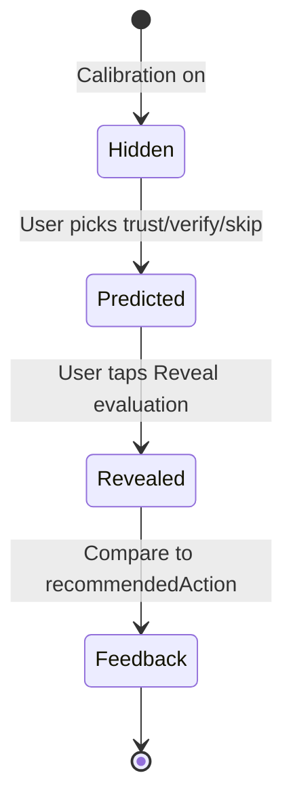
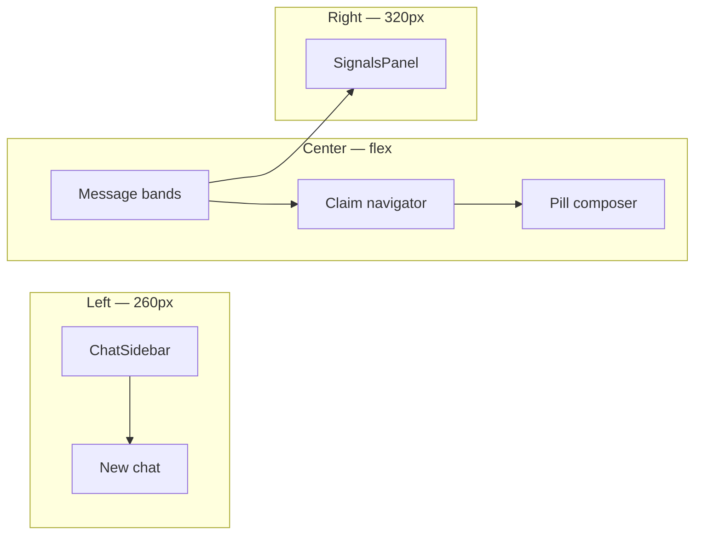
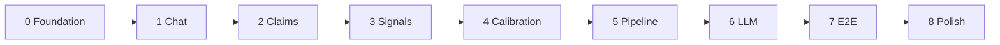

# Trace — System Architecture

Trace is an **evaluation layer** inside a ChatGPT-like chat UI. For every **claim** in an AI answer, it surfaces five signals—**source**, **reasoning**, **assumptions**, **confidence**, and **uncertainty**—plus an optional **calibration mode** where users predict trust / verify / skip before markers are revealed.

**Build status:** Phases 0–7 complete · Phases 8–9 planned  
**Detailed rollout:** [docs/PHASES.md](docs/PHASES.md) · **Decisions:** [docs/DECISIONS.md](docs/DECISIONS.md)

---

## 1. System context



| Actor / system | Role |
|----------------|------|
| **User** | Chats, selects claims, calibrates trust (later phases) |
| **Chat UI** | ChatGPT-like shell: sidebar, banded thread, pill composer |
| **Trace layer** | Claim spans, five signals, calibration feedback |
| **Mock assistant** | Keyword-matched fixture replies (current) |
| **LLM** | Live answers (planned) |
| **Evaluate pipeline** | Text → claims + `SignalSet` (planned) |

---

## 2. Layered architecture



| Layer | Responsibility | Current modules |
|-------|----------------|-----------------|
| **Presentation** | UI, layout, interaction | `src/components/chat/*`, `evaluation/*`, `icons/*` |
| **Application** | Session state, send flow, claim selection, calibration, persistence | `useChat`, `useClaimSelection`, `useCalibration`, `useClaimKeyboardNav` |
| **Domain** | Types, claim hydration, fixtures | `src/types`, `src/lib`, `src/fixtures` |
| **Infrastructure** | Mock LLM, evaluate API, session storage, export | `mock-assistant.ts`, `evaluate-stub.ts`, `session-storage.ts`, `export-session.ts`, `app/api/*` |

---

## 3. Core domain model

The **claim** is the unit of evaluation; **messages** are containers.



### Key types (`src/types/index.ts`)

| Type | Purpose |
|------|---------|
| `Message` | User or assistant chat line |
| `Claim` | Atomic statement + span + signals + `recommendedAction` |
| `SignalSet` | Five evaluation fields |
| `MessageEvaluation` | All claims for one assistant message |
| `Session` | Messages + evaluations (fixture / future server model) |
| `CalibrationChoice` | `trust` \| `verify` \| `skip` |
| `CalibrationState` | Per-claim predictions before reveal (Phase 4+) |

### Claim addressing

Claims reference assistant text via **`TextSpan`** `{ start, end }` (UTF-16 offsets). Helpers in `src/lib/spans.ts` and `src/lib/claims.ts` resolve and hydrate claim text from message content.

---

## 4. Repository structure

```
TRACE/
├── architecture.md          ← this file
├── docs/
│   ├── PHASES.md            # Phased build plan
│   └── DECISIONS.md         # Locked product/tech choices
├── src/
│   ├── app/                 # Next.js App Router
│   │   ├── layout.tsx
│   │   ├── page.tsx         # Entry → ChatShell
│   │   └── globals.css      # Tailwind + token theme
│   ├── components/
│   │   ├── chat/            # Thread, claims, composer
│   │   ├── evaluation/      # Signals sidebar
│   │   └── session/         # Export + calibration stats (Phase 8)
│   ├── fixtures/            # Mock sessions + claims
│   ├── hooks/               # useChat, useCalibration, useClaimSelection, …
│   ├── lib/                 # ids, claims, mock, session-storage, export
│   ├── styles/
│   │   └── tokens.css       # Design tokens
│   └── types/               # Shared contracts
├── .env.example
└── package.json
```

---

## 5. Runtime flows

### 5.1 Send message + stream (Phase 7)



- **Stub mode:** fixture reply streamed word-by-word  
- **LLM mode:** OpenAI streaming via `/api/chat`  
- **Settings:** model + calibration default in sidebar (`useSettings`)

### 5.2 Evaluate assistant reply



Phase 5+ calls `POST /api/evaluate` after each assistant reply. Phase 6 uses OpenAI when `OPENAI_API_KEY` is set (`evaluate-llm.ts` + `evaluate-pipeline.ts`), with stub fallback.

### 5.2a Select claim (implemented — Phase 2)



### 5.3 Calibration loop (implemented — Phase 4)



Signals stay **hidden** until the user reveals after a prediction (`useCalibration` + `SignalsPanel`). Optional **Reveal all** when every claim in the answer has a prediction.

---

## 6. UI composition — ChatGPT-like shell

The prototype mirrors **ChatGPT’s dark layout** for the chat experience. Trace-specific evaluation sits in a **right panel** (not present in stock ChatGPT).



### Layout regions

| Region | ChatGPT parity | Trace-specific |
|--------|----------------|----------------|
| **Left sidebar** (`ChatSidebar`) | Logo, “New chat”, dark `#171717` | Prototype note in footer |
| **Message thread** | Full-width **bands**; user `#303030`, assistant `#212121` | Claim highlights in assistant text |
| **User message** | Rounded container, right-weighted in column | Same |
| **Assistant message** | Avatar + plain text (no bubble) | Same + claim spans |
| **Composer** | Rounded pill `#2f2f2f`, circular send button | Disclaimer line below |
| **Empty state** | Centered “What can I help with?” + suggestion chips | Chips send mock prompts |
| **Right panel** (`SignalsPanel`) | — | Five evaluation signals |

### Responsive behavior

| Breakpoint | Sidebar | Evaluation panel |
|------------|---------|-------------------|
| `< md` | Drawer + menu button | Shown only when a claim is selected |
| `≥ md` | Fixed left column | Always visible (empty state when no selection) |

**Decisions:** [docs/DECISIONS.md](docs/DECISIONS.md) — ChatGPT visual parity + persistent eval sidebar.

### Component map

| Component | File |
|-----------|------|
| Shell / layout | `ChatShell.tsx` |
| Left nav | `ChatSidebar.tsx` |
| Messages | `MessageBubble.tsx`, `MessageThread.tsx` |
| Claims | `ClaimHighlightedText.tsx`, `ClaimNavigator.tsx` |
| Input | `Composer.tsx` |
| Evaluation | `SignalsPanel`, `CalibrationPredict`, `CalibrationFeedback`, `CalibrationSummary` |
| Calibration logic | `hooks/useCalibration.ts`, `lib/calibration-feedback.ts` |
| Session persistence | `lib/session-storage.ts`, `types/session-storage.ts` |
| Export | `lib/export-session.ts`, `components/session/SessionExport.tsx` |
| Keyboard nav | `hooks/useClaimKeyboardNav.ts` |
| Icons | `components/icons/ChatIcons.tsx` |

| Feature | Phase | Status |
|---------|-------|--------|
| ChatGPT-like chat chrome | UI refresh | Done |
| Claim highlights + selection | 2 | Done |
| Signals sidebar (5 fields) | 3 | Done |
| Calibration predict → reveal → feedback | 4 | Done |
| Full session persistence + export | 8 | Done |
| Grounding URLs, human review, batch eval, SDK | 9 | Done |

---

## 7. Technology stack

| Concern | Choice |
|---------|--------|
| Framework | Next.js 15 (App Router) |
| UI | React 19, TypeScript |
| Styling | Tailwind CSS v4 + `src/styles/tokens.css` |
| State | React hooks (`useChat`); context in later phases |
| Persistence (prototype) | `localStorage` via `src/lib/session-storage.ts` (`trace-session-v2`) |
| API (future) | Next.js Route Handlers under `src/app/api/` |
| LLM (future) | Provider SDK + JSON schema (Phase 6+) |

---

## 8. Design system

Tokens live in `src/styles/tokens.css` and map into Tailwind via `src/app/globals.css`.

### ChatGPT-like chrome (dark)

| Token | Typical value | Use |
|-------|---------------|-----|
| `--trace-sidebar` | `#171717` | Left nav + eval panel background |
| `--trace-bg` | `#212121` | Main chat / assistant bands |
| `--trace-user-band` | `#303030` | User message row |
| `--trace-composer` | `#2f2f2f` | Input pill |
| `--trace-text` | `#ececec` | Body copy |
| `--trace-text-muted` | `#b4b4b4` | Hints, labels |
| `--trace-border` | `rgba(255,255,255,0.1)` | Dividers, borders |
| `--trace-accent` | `#10a37f` | Logo / focus (ChatGPT green) |
| `--trace-send-active` | `#ffffff` | Send button when enabled |

### Trace evaluation semantics

| Token family | Use |
|--------------|-----|
| `--trace-trust`, `--trace-verify`, `--trace-skip` | Calibration (Phase 4+) |
| `--trace-confidence-*` | low / medium / high meter |
| `--trace-claim-*` | Claim highlight (blue on dark text) |

### Layout constants

| Token | Default |
|-------|---------|
| `--trace-sidebar-width` | `260px` |
| `--trace-eval-width` | `320px` |
| `--trace-thread-max` | `48rem` |

---

## 9. Fixture data

Two reference sessions in `src/fixtures/sessions.ts`:

| Session ID | Topic | Claims |
|------------|-------|--------|
| `session-caffeine` | Coffee / health | 5 |
| `session-solar` | Solar / grids | 5 |

Each claim includes a full `SignalSet` and `recommendedAction` for future calibration feedback.

---

## 10. Phased roadmap (summary)



| Phase | Name | Status |
|-------|------|--------|
| 0 | Foundation & contracts | Complete |
| 1 | Chat shell | Complete |
| 2 | Claim highlighting | Complete |
| 3 | Evaluation signals panel | Complete |
| 4 | Calibration mode | Complete |
| 5 | Evaluate pipeline (stub API) | Complete |
| 6 | LLM-generated claims/signals | Complete |
| 7 | Live chat + Trace E2E | Complete |
| 8 | Persistence, a11y, polish | Complete |
| 9 | Grounding, review, batch, SDK | Complete |

---

## 11. Principles

1. **Mock-first** — UI and flows on fixtures before LLM or backend.  
2. **Claim-centric** — Evaluation attaches to claims, not whole messages.  
3. **Reveal discipline** — Calibration hides signals until prediction.  
4. **Vertical slices** — Each phase is independently demoable.  

---

## 12. Security & configuration

- Secrets via environment variables (see `.env.example`); never commit API keys.  
- Phase 8 persists the full session in `localStorage` (`trace-session-v2`): messages, evaluations, calibration state, and active claim. Legacy message-only storage migrates automatically. Export as JSON or Markdown from the sidebar.  

---

*Last updated: Phases 0–9 complete.*
