# Trace — Phased Build Architecture

Evaluation layer inside a ChatGPT-like chat UI. Each **claim** in an assistant answer gets five signals (source, reasoning, assumptions, confidence, uncertainty). **Calibration mode** lets users predict trust / verify / skip before markers are revealed.

This document defines build phases only. **Do not implement until a phase is explicitly started.**

---

## Principles (all phases)

- **Mock-first:** Ship UI and flows with static/sample data before any LLM or backend.
- **Claim-centric:** The claim is the unit of evaluation; chat messages are containers.
- **Reveal discipline:** Calibration mode must hide evaluation signals until the user commits a prediction.
- **Incremental vertical slices:** Each phase should be demoable on its own.

---

## Phase 0 — Foundation & contracts

**Goal:** Repo structure, tooling, and shared types so later phases don’t rework foundations.

| Area | Scope |
|------|--------|
| Project | App scaffold (framework, lint, env pattern), folder layout |
| Data contracts | `Message`, `Claim`, `SignalSet`, `CalibrationChoice`, `Session` types |
| Sample fixtures | 1–2 canned assistant replies with 3–8 claims each, full signal payloads |
| Design tokens | Typography, spacing, semantic colors for trust / verify / skip / confidence |

**Out of scope:** Real chat, claim UI, calibration logic.

**Exit criteria:** Types + fixtures load in dev; no user-facing product yet.

**Depends on:** Nothing.

---

## Phase 1 — Chat shell (no evaluation)

**Goal:** ChatGPT-like conversation UI without Trace features.

| Area | Scope |
|------|--------|
| Layout | Thread + composer; user/assistant bubbles |
| Messaging | Send user message; append assistant reply (from fixture or stub) |
| State | In-memory thread; optional local persistence stub |
| UX | Loading state, empty state, scroll-to-latest |

**Out of scope:** Claim highlighting, signals panel, calibration.

**Exit criteria:** User can run a multi-turn chat using mock assistant responses.

**Depends on:** Phase 0.

---

## Phase 2 — Claim segmentation & highlighting

**Goal:** Assistant text is split into selectable **claims** in the thread.

| Area | Scope |
|------|--------|
| Rendering | Inline or block highlights per claim; hover/focus affordance |
| Selection | Click claim → sets “active claim” for downstream panels |
| Data | Claims driven from fixture `Claim` spans (offsets or segment IDs) |
| Navigation | Optional prev/next claim within a message |

**Out of scope:** Five signals content, calibration, LLM extraction.

**Exit criteria:** User sees distinct claims in a mock answer and can select one; selection state is visible.

**Depends on:** Phase 1.

---

## Phase 3 — Evaluation signals (always visible)

**Goal:** For the active claim, show all five signals in a dedicated evaluation UI.

| Area | Scope |
|------|--------|
| Signals | Source, reasoning, assumptions, confidence, uncertainty |
| Layout | Side panel, drawer, or inline expansion (pick one pattern and stick to it) |
| Confidence | Visual scale (e.g. low / medium / high) aligned to fixture data |
| Assumptions | List or chips; uncertainty as explicit “what we don’t know” |

**Out of scope:** Calibration, hiding signals, scoring predictions.

**Exit criteria:** Selecting a claim shows all five signals from mock data; switching claims updates the panel.

**Depends on:** Phase 2.

---

## Phase 4 — Calibration mode (core product loop)

**Goal:** User predicts **trust / verify / skip** per claim **before** evaluation is revealed; then compare to Trace’s view.

| Area | Scope |
|------|--------|
| Mode toggle | Global or per-message “calibration on” |
| Pre-reveal UI | Per-claim trust / verify / skip (no signal panel yet) |
| Reveal | After choice (or “reveal all”), show Phase 3 signals |
| Feedback | Simple match/mismatch or “you chose verify, Trace flags low confidence” (rule-based on fixtures) |
| Session summary | End-of-answer stats: predictions vs suggested actions |

**Out of scope:** Real scoring model, LLM-generated “ground truth,” persistence across devices.

**Exit criteria:** Full loop demo: predict → reveal → feedback on mock thread; signals hidden until reveal.

**Depends on:** Phase 3.

---

## Phase 5 — Evaluation pipeline (still mockable backend)

**Goal:** Replace hand-authored fixture spans with a **pipeline** that produces claims + signals (stub or API).

| Area | Scope |
|------|--------|
| API boundary | `POST /evaluate` or equivalent: message text → `Claim[]` + `SignalSet[]` |
| Stub service | Deterministic parser or rules on sample strings for demos |
| Integration | Assistant reply triggers evaluate; UI unchanged from Phases 2–4 |
| Errors | Graceful degradation if evaluation fails (show message, no claims) |

**Out of scope:** Production LLM prompts, citation crawling, user accounts.

**Exit criteria:** New assistant text (within supported mock rules) gets claims + signals without editing fixtures by hand.

**Depends on:** Phase 4 (UI stable); can parallelize stub API with Phase 4 if contracts from Phase 0 are fixed.

---

## Phase 6 — LLM-assisted extraction & signals

**Goal:** Real (or hosted) model generates claims and populates the five fields.

| Area | Scope |
|------|--------|
| Claim extraction | Model segments answer into atomic claims |
| Signal generation | Structured output per claim (JSON schema enforced) |
| Source field | Citations, quotes, or “model knowledge” with honesty about gaps |
| Guardrails | Timeouts, retries, max claims per message, cost caps |
| Dev vs prod | API keys via env; never commit secrets |

**Out of scope:** Automated fact-checking against the open web, legal/compliance sign-off.

**Exit criteria:** Live assistant reply (via your chosen LLM) produces claims + five signals usable by existing UI.

**Depends on:** Phase 5.

---

## Phase 7 — Chat + assistant integration

**Goal:** End-to-end product: user chats with an AI; Trace evaluates each assistant turn.

| Area | Scope |
|------|--------|
| Assistant | Streaming or single-shot replies from chat API |
| Orchestration | User message → assistant → evaluate → render claims |
| Calibration | Works on streamed-complete message (evaluate on finish) |
| Settings | Model pick, calibration default on/off |

**Out of scope:** Multi-user auth, billing, team workspaces.

**Exit criteria:** One coherent demo: ask question, get answer, calibrate on claims, reveal Trace evaluation.

**Depends on:** Phase 6.

---

## Phase 8 — Persistence, history & polish

**Goal:** Sessions survive refresh; UX feels shippable for user tests.

| Area | Scope |
|------|--------|
| Persistence | Thread history, calibration choices, reveal state |
| Export | Optional JSON/markdown export of thread + evaluations |
| A11y | Keyboard claim navigation, ARIA for panel and modes |
| Performance | Virtualize long threads; debounce evaluate |
| Analytics (optional) | Local or privacy-preserving events: calibration accuracy trends |

**Out of scope:** Enterprise SSO, admin dashboards.

**Exit criteria:** Refresh restores session; prototype ready for moderated user studies.

**Depends on:** Phase 7.

---

## Phase 9 (optional) — Research & scale hooks

**Goal:** Extensions if the prototype validates.

| Area | Scope |
|------|--------|
| Grounding | Retrieval / URLs feeding **source** |
| Human review | Label overrides for claims and signals |
| Batch eval | Upload document → claim report |
| API/SDK | Embed Trace evaluation in other apps |

**Depends on:** Phase 8 and product decision.

---

## Dependency graph

```mermaid
flowchart LR
  P0[Phase 0 Foundation]
  P1[Phase 1 Chat shell]
  P2[Phase 2 Claims]
  P3[Phase 3 Signals]
  P4[Phase 4 Calibration]
  P5[Phase 5 Pipeline stub]
  P6[Phase 6 LLM signals]
  P7[Phase 7 E2E chat]
  P8[Phase 8 Polish]
  P9[Phase 9 Optional]

  P0 --> P1 --> P2 --> P3 --> P4
  P4 --> P5 --> P6 --> P7 --> P8 --> P9
```

---

## Suggested stack (decide in Phase 0, not before)

| Layer | Option A | Option B |
|-------|----------|----------|
| UI | Next.js (App Router) + React | Vite + React |
| Styling | Tailwind + shadcn/ui | CSS modules |
| State | React context + hooks | Zustand |
| API | Next route handlers | Separate Node/Fastify service |
| LLM (Phase 6+) | Provider SDK + structured output | Same |

Lock one column in Phase 0 so Phases 1–4 don’t churn.

---

## What to build first (when you say “start”)

Recommended order: **0 → 1 → 2 → 3 → 4** gives a complete, demoable prototype on mocks. Phases 5–7 add realism; Phase 8 prepares for users.

---

## Open decisions (resolve before or during Phase 0)

1. **Claim granularity:** sentence-level vs. proposition-level splits.
2. **Calibration unit:** per claim only vs. per message batch reveal.
3. **“Ground truth” for calibration feedback:** rule-based on confidence thresholds vs. explicit `recommendedAction` on each claim in fixtures.
4. **Signal panel pattern:** persistent sidebar vs. contextual popover.
5. **Target environment:** local-only demo vs. deployable preview (affects Phase 8).

---

*Phases 0–9: complete.*
